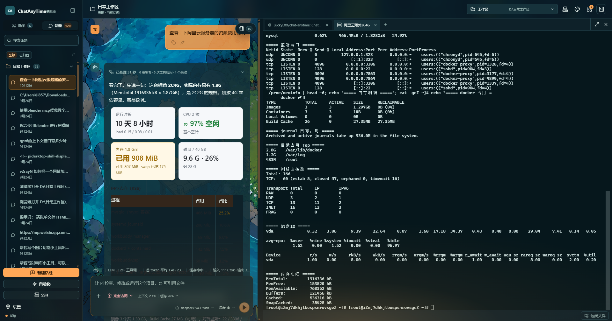
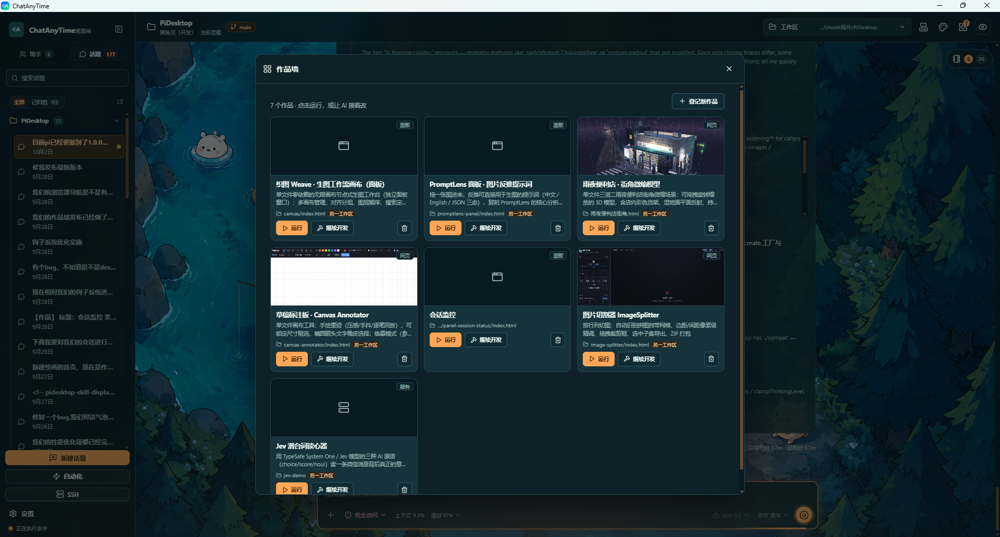

# ChatAnyTime

ChatAnyTime 是一个面向项目开发的桌面 AI 客户端。它以 Pi 的执行、会话和工具能力为底座，重新实现桌面交互，并延续 ChatAnyTime 的富内容渲染理念。


## 界面预览

| SSH 远程面板 | 作品墙 |
| --- | --- |
|  |  |
| 主机/分组管理 + 指纹信任、远端 PTY 终端、远端文件面板（SFTP 上传/下载） | AI 做出来的成果登记成「作品」，`file` / `server` / `panel` 三种形态，面板型作品可脱离主窗口常驻 |

## 当前能力

### 会话与工作区

- 每个助手记住自己最后使用的工作区，另有「默认工作区」兜底，切助手/移除工作区都不会掉进空白页
- 多会话并行：切走的会话在后台继续跑，侧栏以四色状态点提示「运行中 / 已完成 / 失败 / 已中止」，回到会话即清零
- 话题管理：置顶、重命名、软归档（「全部 / 已归档」双屏）+ 多选批量归档/恢复/删除
- 分屏：最多 4 格，每格有自己的输入框、草稿、模型与思考级别，拖动分隔条调比例，会话右键即可分屏
- 轮次缩略导航与长会话窗口化：长对话只渲染视口附近的内容，滚动与切换仍然跟手

### 模型与 Agent

- 配置多个 OpenAI 兼容中转站，拉取上游模型列表，并可逐个覆盖「是否支持图片输入」
- 输入区快捷切换模型与思考级别；状态行实时显示上下文占用与流式 `~N tok/s`
- Agent 角色：人格与系统提示词、技能勾选、内建工具开关；会话与长期记忆均按助手隔离
- 子代理：`delegate_agent` 单层委派，内置「代码审查 / 项目探索 / 通用」三类角色（前两者只读），可自定义（系统提示/模型/工具集），执行过程在侧栏以嵌套事件流呈现
- 图片识别兜底：对话模型不支持图片输入时，附件自动交给指定的多模态模型识别，模型也可以用 `recognize_images` 读工作区里的图片文件

### 工具与执行

- Pi 原生工具（`read` / `bash` / `edit` / `write` / `grep` / `find` / `ls`，另有可选开启的 Windows 原生 `powershell`），全程流式展示参数、输出与文件 Diff
- 可中断执行：任务面板里能单独停掉某条 shell 命令，进程树被清理但本轮回复继续
- 代码模式（codemode）：一次调用里写一段沙箱脚本批量调用其它工具（并行读多文件、批量统计、大输出预筛），脚本内的工具调用同样走权限与审计
- 权限四档：只读 / 每次询问 / 工作区访问 / 完全访问；「本会话允许」按 `工具:风险` 组合记忆，不会让普通写入授权顺带放开工作区外写入
- 计划模式：先出计划、经你审批后实施，批准的计划留档 `docs/plans/`，也可以直接移交给新会话执行
- Checkpoint 回滚：AI 每次写文件前即时快照，交付物行内一键恢复到回复前状态
- 任务清单：`todo_write` 整表替换维护清单，右上角任务面板随会话切换，只读实时展示

### 富内容与预览

- 流式 Markdown / GFM / 代码高亮 / KaTeX / Mermaid，思考过程与工具调用分轮折叠
- DIV 气泡：助手可以输出可交互的 HTML 卡片，在聊天窗口内直接渲染
- HTML/SVG Artifact 在隔离 iframe 中预览；Markdown 预览带文档大纲、多标签与全屏
- 附件：回形针、粘贴、拖拽添加图片或工作区文件；回复可一键分享为长图
- 图片请求体积治理：入模型前按字节预算压缩历史图片并留占位符，避免撞上上游网关的请求体上限

### 内置浏览器与终端

- 完整的内置浏览器预览面板（标签页、地址栏、前进/后退/刷新、书签、人工下载「保存/另存为」决策）
- 15 个 `browser_*` 自动化工具：导航 / 快照 / 点击 / 输入 / 按键 / 滚动 / 下拉 / 上传 / 求值 / 截图 / 整页截图 / 等待 / 取文本 / 标签页管理 / 页面图片直存工作区；`navigate` 与写模式 `eval` 走同一权限闸口，操作期间页面顶部有横幅提示
- 手动元素选取：预览工具栏的准星进入选取模式，点击页面元素即把「来自内置浏览器」的上下文块填进输入框
- 终端面板：主进程 node-pty + xterm.js 的真实 shell，独立于 AI 的 `bash` 工具
- SSH 面板：主机与分组管理、指纹信任、远端 PTY 终端，以及同一区域内的远端文件面板（浏览 / 上传 / 下载，带进度与取消）

### 作品墙（Gallery）

- 把 AI 做出来的成果登记成「作品」，随时一键运行或让 AI 接着改：`file`（单文件网页）、`server`（目录 + 启动命令，运行会真的起服务并等地址就绪）、`panel`（独立窗口，主界面关掉后仍常驻，页面可读本机执行状态）
- 全局一份作品池（跨工作区不丢）、自动缩略图、标签与排序；入口在顶栏下拉、文件树右键、预览工具栏与空态页

### 主题与外观

- 明暗双模式语义变量换肤；密度、圆角、气泡/面板/壁纸透明度运行时调节，实时预览
- 10 套内置预设主题，另可导入 CSS 或整个主题目录（图片/字体随目录走，落盘为真实文件并走内部协议读取）
- 稳定的结构契约：`data-pane` / `data-control` / `data-role` / `data-ui-*` 状态与 `--pi-layer-*` 装饰层，主题可以重设计面板、按钮与整屏氛围而不碰 DOM 结构
- 随包内置「PiDesktop 主题创建器」技能与确定性校验器（变量覆盖度 / 对比度 / 钩子名 / 可移植性），见 [`docs/theme-guide.md`](docs/theme-guide.md)

### 能力管理

- **MCP Server**：stdio / HTTP 双传输，HTTP 可配自定义请求头（Authorization / X-API-Key 等，与 Claude Code / Cursor 的 `.mcp.json` 同字段），OAuth 授权（含凭据持久化与自动刷新），状态与工具数实时显示；新增或替换的工具热生效，无需重建会话
- **技能 Skill**：四档来源，优先级从低到高为 共享目录 `~/.agents/skills` < 随包内置 < 用户全局 `pidesktop-skills/` < 项目 `.pidesktop-skills/`，同名后者覆盖前者；勾选启用后注入系统提示，用 `/skill:<name>` 调用；内置电脑控制、自动化任务、网页任务、作品发布、ChatAnyTime 配置、主题创建器
- **自定义命令**：项目/全局双作用域的 `md` 模板，`/名字 参数` 直接调用
- **子智能体**：设置页自定义系统提示、模型、思考等级与工具集（全局/项目作用域），内置「代码审查 / 项目探索」为只读、可在设置里单独改执行模型与思考等级（委派卡片上显示实际生效档位）
- **钩子 Hooks**：9 类事件（会话开始/结束、工具调用前/后、工具结果、用户输入、轮次结束、回复结束、压缩前）驱动桌面通知、HTTP 回调、命令执行或阻断拦截，规则可单条试跑
- **长期记忆**：按助手隔离的 markdown 主题库，跨会话检索，记忆面板可治理
- **自动化任务**：cron 定时任务后台无人值守运行，运行记录可回看
- **用量统计**：按助手统计 token 与花费

## 安装

从 [Releases](https://github.com/LuckyLXX/chat-anytime/releases/latest) 下载 `ChatAnyTime Setup <版本>.exe` 安装包，双击安装即可（Windows x64）。

- 首次运行建议确认已安装 **VC++ 2015-2022 x64 Redistributable**（部分系统缺少它时，终端/剪贴板相关功能会提示缺少 `VCRUNTIME140.dll`）
- 安装包由 GitHub Actions 在打 tag 时自动构建并上传，构建过程在 CI 上可复现（`npm ci` 干净安装 + `npm test` + `verify-package` 校验）

## 架构

```text
Electron main
├── 窗口、目录选择和设置持久化
├── Renderer IPC
└── Pi Runtime utilityProcess 生命周期

Pi Runtime utility process
├── @earendil-works/pi-coding-agent 1.0.0
├── AgentSession / SessionManager / ModelRuntime
├── Pi 原生项目工具
├── 权限扩展
└── 稳定的 RuntimeMessage / RuntimeSnapshot 输出

React renderer
├── 项目、会话和模型界面
├── 消息流与工具时间线
├── Activity / Changes 面板
└── 富内容与 Artifact 渲染
```

主进程与 React 界面之间的稳定协议位于 `src/shared/protocol.ts`。React 不直接依赖 Pi 的运行时对象，因此后续升级 Pi 或替换桌面壳时，不需要同时重写渲染层。

## 环境与启动

依赖安装要求 Node.js `>=22.19.0`。Electron 43 自带的 Node 运行时满足 Pi `1.0.0` 的运行要求。

```powershell
npm install
npm run dev
```

构建和测试：

```powershell
npm test
npm run build
```

生成可直接运行的 Windows 目录，或直接生成安装包：

```powershell
npm run package:win         # dist\win-unpacked\ChatAnyTime.exe
npm run package:installer   # dist\ChatAnyTime Setup <版本>.exe
```

## 模型鉴权

应用通过 Pi 的 `ModelRuntime` 读取 Pi 已支持的 Provider 和现有鉴权来源。API Key 由主进程使用 Electron `safeStorage` 加密到 `userData/credentials.json`，应用启动时解密后仅注入 Pi 运行进程；界面只显示“已配置”，不会回显密钥内容。首次启动时会迁移旧版 `customProviderApiKey`，加密校验失败则保留旧数据并只在内存中使用。

自定义中转站使用 OpenAI Chat Completions 兼容协议，接口地址填写 API 根地址，例如 `https://proxy.example.com/v1`，不要填写具体的 `/chat/completions` 路径。重新打开设置时，API Key 留空即可继续使用已保存的密钥。

## 权限模型

- `bash`：每个命令作用域需要确认
- `edit` / `write`：写入工作区内文件时需要确认
- 工作区外路径：所有工具都需要单独确认
- `Allow for session` 仅授权相同的 `tool:risk` 组合，不会让普通写入授权自动覆盖工作区外写入
- HTML/SVG Artifact 在无同源权限的 sandbox iframe 中运行，无法直接访问桌面 API
- 浏览器自动化：`browser_navigate` 与写模式的 `browser_eval` 携带 `browse` 风险走同一权限闸口；其余页面内操作视为可信
- 用户钩子的 `command` 动作是用户自写的终端级信任配置，绕过 AI 权限闸口执行（超时与进程树清理受控），上下文只经 stdin/环境变量进入

## 数据存放位置

| 位置 | 内容 |
| --- | --- |
| `%APPDATA%\chat-anytime\` | `settings.json`（设置，含主题定义与工作区记忆）、`credentials.json`（`safeStorage` 加密的密钥） |
| `~/.pi/agent/` | 会话 JSONL、任务清单、计划/设计模式开关、Checkpoint 快照、工具审计日志、长期记忆、作品墙、主题资产文件、MCP/技能/命令/钩子/子智能体配置 |
| `<工作区>\` | `docs/plans/`（批准的计划留档）、`designs/`、`.pidesktop/`（截图、下载、求值产物） |

设置文件由应用整体重写，请勿手工编辑；需要改动请在设置页操作。

配置类资源都在 `~/.pi/agent/`（项目级则在工作区根）下，放好后在「设置 → 技能与工具」右上角「重载资源」即可生效：

| 资源 | 全局 | 项目 |
| --- | --- | --- |
| MCP Server | `mcp.json` | `.mcp.json` |
| 技能 Skill | `pidesktop-skills/<slug>/SKILL.md` | `.pidesktop-skills/` |
| 自定义命令 | `pidesktop-commands/*.md` | `.pidesktop-commands/` |
| 钩子 Hooks | `pidesktop-hooks.json` | `.pidesktop-hooks.json` |
| 子智能体 | `pidesktop-subagents.json` | `.pidesktop-subagents.json` |

> 技能与命令正文是热生效的（每次读取取实物），但新增/删除技能与命令、以及 MCP/钩子/子智能体的任何改动，都需要重载资源或重启应用。

## 主题

主题是一份 CSS（可选：同目录图片/字体资产），导入方式为「设置 → 外观 → 导入 CSS / 导入主题目录」。仓库 [`themes/`](themes/) 里备了两套可直接导入的示例主题：

| 主题 | 风格 |
| --- | --- |
| [`forest-holiday`](themes/forest-holiday) | 森野假日：等距插画明暗双壁纸（盛夏西瓜池 / 夜森营地）+ 纯 CSS 场景感动效 |
| [`pidesktop-anime-pink-dog-theme`](themes/pidesktop-anime-pink-dog-theme) | 粉发动漫少女与大白犬：春日草地 / 屋顶星夜双壁纸，低透明度铺底 + 粉白配色 |

`themes/forest-holiday/README.md` 记录了该主题的设计取舍与核验结论；主题编写契约与钩子清单见 [`docs/theme-guide.md`](docs/theme-guide.md)，也可以直接让助手用内置的「PiDesktop 主题创建器」技能来写。

## 与 Pi 及原插件的关系

- Pi `1.0.0` 仅作为 Agent 运行时核心使用：模型、AgentSession、会话持久化、上下文管理、内置工具（read/bash/edit/write/grep/find/ls）
- 已移除 Pi 的「扩展接入」能力（第三方扩展加载/批准/绑定、`pi-mcp-adapter`、子代理 CLI shim、扩展 UI 桥），只保留应用自有的内联扩展：权限闸口、工具审计、用户钩子、计划模式注入、Checkpoint 快照
- MCP、Skill、子代理、Todo、记忆均为自研实现：MCP 由内置 `@modelcontextprotocol/sdk` 客户端直连并把每个工具包装成 Pi `customTool`；Skill 通过扫描 `SKILL.md` 目录并注入系统提示；子代理用 `delegate_agent` 创建同进程子会话；Todo 与记忆用本地文件存储
- 本项目沿用 ChatAnyTime 品牌与核心渲染、交互理念，没有复制原插件运行时或旧代码
- Pi 原仓库和 ChatAnyTime 原插件仓库均不属于本项目，也不会被本项目构建修改

## 当前限制

- 暂不支持 Git 工作树管理
- MCP 新增/替换的工具热生效，但**删除**工具仍需重建会话（Pi 没有工具注销 API）；stdio 类型 MCP 子进程在应用退出时未做优雅关闭，极少数情况下可能残留
- HTML/SVG Artifact 只提供隔离预览，不提供桌面能力桥接（需要常驻与本地状态的作品请用「面板」形态）
- 尚未提供自动更新与代码签名，升级需要手动下载安装包
- 尚无主题/壁纸在应用内的可视化编辑器，结构主题请交给内置的主题创建器技能
- `npm audit --omit=dev` 会报告 5 项关联风险（`hono` / `qs` / `fast-uri` / `ip-address` 来自内置 `@modelcontextprotocol/sdk` 的传递依赖，`brace-expansion` 来自 Pi 运行时的 `minimatch` 依赖链），均可由上游发版或 `npm audit fix` 处理
- 图片请求体积治理按「上游网关 8MB 请求体」校准；换成更小上限的网关需要同步调整预算常量

<p align="center">
    <a href="https://linux.do" alt="LINUX DO"></a>
</p>

## 开源协议

本项目以 [MIT License](LICENSE) 开源。欢迎提交 Issue 与 Pull Request；架构约束与开发约定见 `AGENTS.md`，主题 API 见 `docs/theme-guide.md`。
