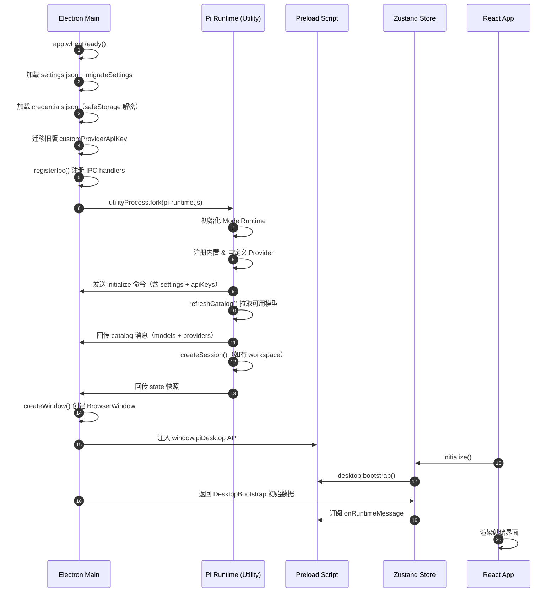
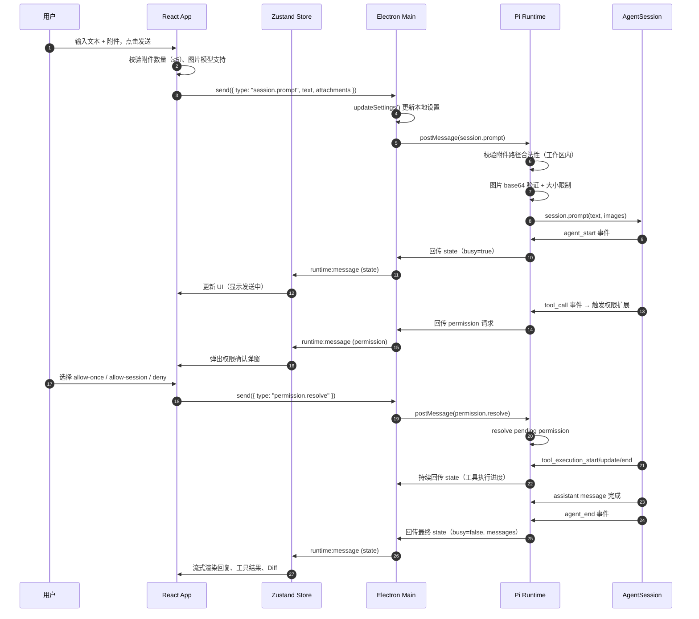
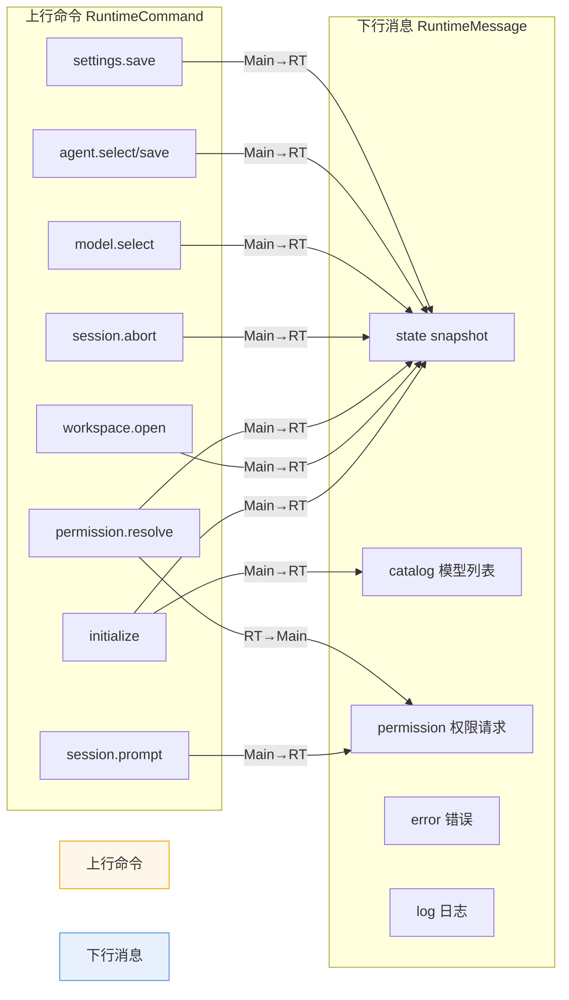

# ChatAnyTime 运行流程图

## 三层架构

```mermaid
%%{init: {'theme': 'base', 'themeVariables': { 'primaryColor': '#e8f0fe', 'primaryTextColor': '#1a1a2e', 'primaryBorderColor': '#4a90d9', 'lineColor': '#4a90d9', 'secondaryColor': '#fef6e8', 'tertiaryColor': '#f0fdf4' }}}%%
graph TB
    subgraph Electron_Main["⚡ Electron Main Process（主进程）"]
        MAIN_APP[应用启动 app.whenReady]
        MAIN_INIT[加载设置 & 迁移旧配置]
        MAIN_CRED[加载 credentials.json<br/>（safeStorage 加密/解密）]
        MAIN_REGISTRY[注册 IPC 处理]
        MAIN_WINDOW[创建主窗口 BrowserWindow]
        MAIN_START_RT[启动 Pi Runtime<br/>utilityProcess.fork]
        MAIN_IPC_RUNTIME[runtime:send 通道<br/>接收用户指令]
        MAIN_IPC_DIALOG[dialog 选择器<br/>工作区 / 附件]
        MAIN_IPC_BOOTSTRAP[bootstrap 获取初始状态]
    end

    subgraph Pi_Runtime["🤖 Pi Runtime（Utility Process）"]
        RT_INITIALIZE[initialize: 构建 ModelRuntime<br/>注册自定义 Provider]
        RT_CATALOG[refreshCatalog: 拉取模型列表]
        RT_SESSION[createSession: 创建 AgentSession<br/>加载 SettingsManager & ResourceLoader]
        RT_PROMPT[session.prompt: 发送用户消息]
        RT_TOOL[工具执行<br/>read/bash/edit/write/grep/find/ls]
        RT_PERMISSION[权限扩展<br/>permissionScope + toolRisk]
        RT_EMIT[state 快照回传]
        RT_EVENTS[AgentSessionEvent<br/>agent_start/end/tool_execution/compaction]
        RT_SNAPSHOT[snapshot: 生成 RuntimeSnapshot]
        RT_NORMALIZE[normalizeMessages<br/>格式化消息流]
    end

    subgraph React_Renderer["🖥️ React Renderer（渲染进程）"]
        APP[App 组件]
        STORE[useDesktopStore<br/>(Zustand 状态管理)]
        BOOTSTRAP[调用 desktop:bootstrap<br/>获取初始状态]
        MSG_LISTENER[onRuntimeMessage<br/>订阅运行时消息]
        UI_CHAT[消息时间线<br/>User / Assistant / Thinking / Tool]
        UI_COMPOSER[输入框 + 附件<br/>模型切换 + 思考级别]
        UI_SIDEBAR[侧栏: Agent 列表 / 话题列表]
        UI_RIGHT[右面板: 活动 / 变更 Diff]
        UI_SETTINGS[设置弹窗<br/>模型服务 / Agent 角色 / 外观]
        UI_PERMISSION[权限确认弹窗]
        UI_ARTIFACT[Artifact 预览 iframe]
    end

    %% IPC 通道
    MAIN_REGISTRY -->|IPC| STORE
    MAIN_IPC_RUNTIME -->|postMessage| RT_INITIALIZE
    MAIN_IPC_RUNTIME -->|postMessage| RT_PROMPT
    MAIN_IPC_RUNTIME -->|postMessage| RT_TOOL
    RT_EMIT -->|postMessage| MAIN_IPC_RUNTIME
    MAIN_IPC_RUNTIME -->|webContents.send<br/>runtime:message| MSG_LISTENER
    MAIN_IPC_BOOTSTRAP --> STORE
    MAIN_IPC_DIALOG -->|dialog.showOpenDialog| MAIN_IPC_RUNTIME

    RT_EVENTS --> RT_SNAPSHOT
    RT_SNAPSHOT --> RT_NORMALIZE
    RT_NORMALIZE --> RT_EMIT

    STORE -->|渲染| UI_CHAT
    STORE -->|渲染| UI_COMPOSER
    STORE -->|渲染| UI_SIDEBAR
    STORE -->|渲染| UI_RIGHT
    STORE -->|触发 send| MAIN_IPC_RUNTIME
    UI_PERMISSION -->|permission.resolve| MAIN_IPC_RUNTIME

    style Electron_Main fill:#e8f0fe,stroke:#4a90d9,stroke-width:2px
    style Pi_Runtime fill:#fef6e8,stroke:#f0a500,stroke-width:2px
    style React_Renderer fill:#f0fdf4,stroke:#22c55e,stroke-width:2px
```

## 启动流程



## 用户发送消息完整流程



## 权限模型

```mermaid
graph LR
    subgraph 工具分类
        T1[bash 命令执行]
        T2[edit/write 文件写入]
        T3[工作区外路径访问]
    end

    subgraph 风险判定
        R1[workspace-relative 校验]
        R2[path.startsWith("..") 拦截]
        R3[工具名 + 风险组合<br/>permissionScope]
    end

    subgraph 决策选项
        D1[🟡 allow-once<br/>仅本次]
        D2[🟢 allow-session<br/>本会话同类不再询问]
        D3[🔴 deny<br/>拒绝]
    end

    T1 --> R1
    T2 --> R1
    T3 --> R2
    R1 --> R3
    R2 --> R3
    R3 --> D1
    R3 --> D2
    R3 --> D3
    D2 -.->|缓存 | R3

    style D1 fill:#fef9c3,stroke:#eab308
    style D2 fill:#bbf7d0,stroke:#22c55e
    style D3 fill:#fecaca,stroke:#ef4444
```

## 关键协议流（Data Flow Summary）


